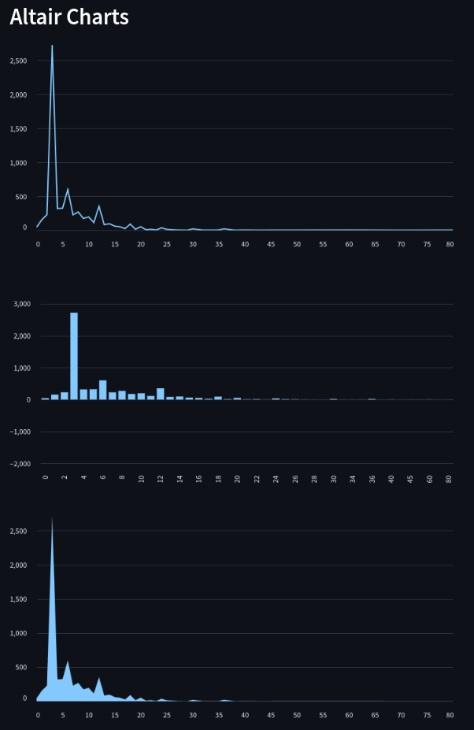
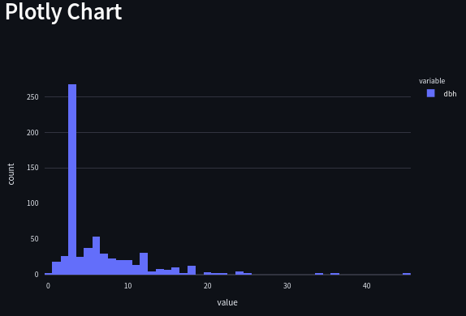
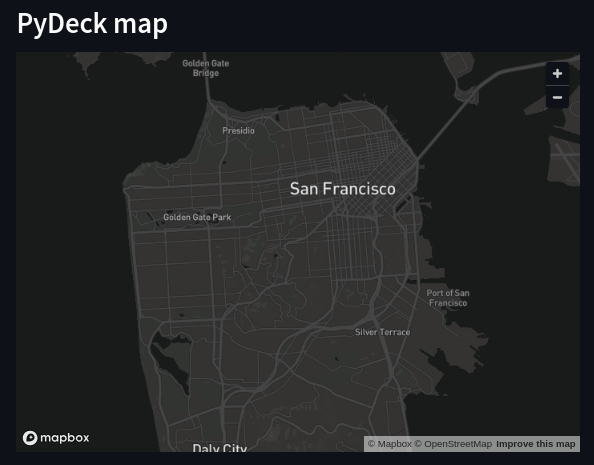
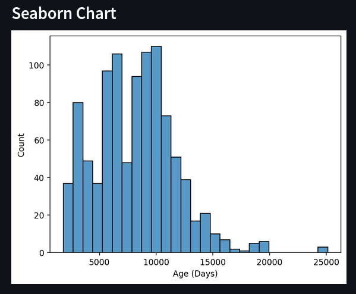
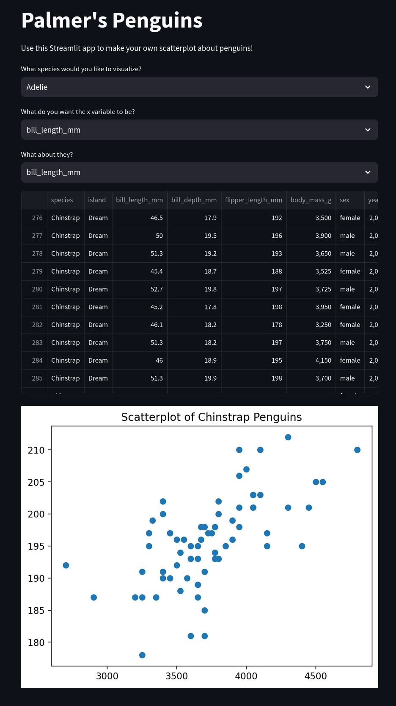
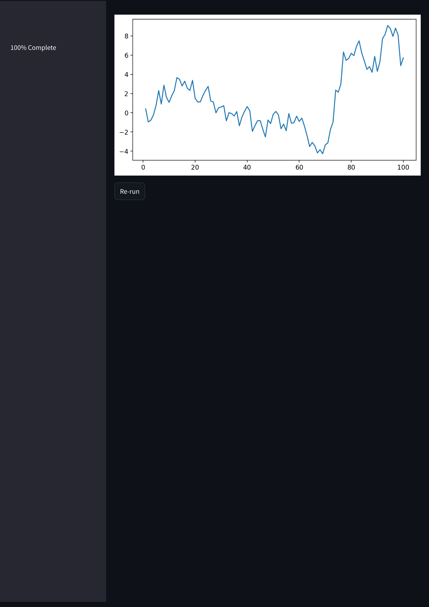

# A simple demonstration of how to use the Streamlit framework

## Altait chart

## Plotly chart

## PyDeck chart

## Seaborn chart

## Selectbox, pandas.read_csv

## Progress bar, button and figure 

